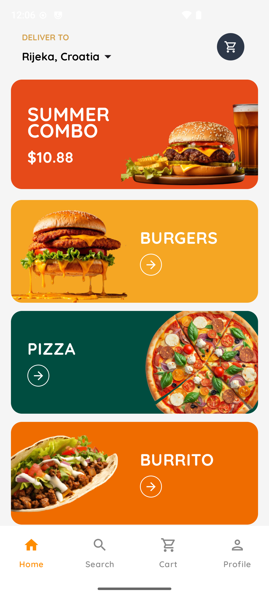
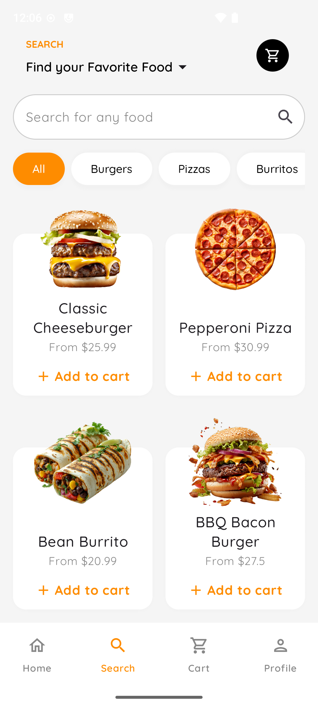
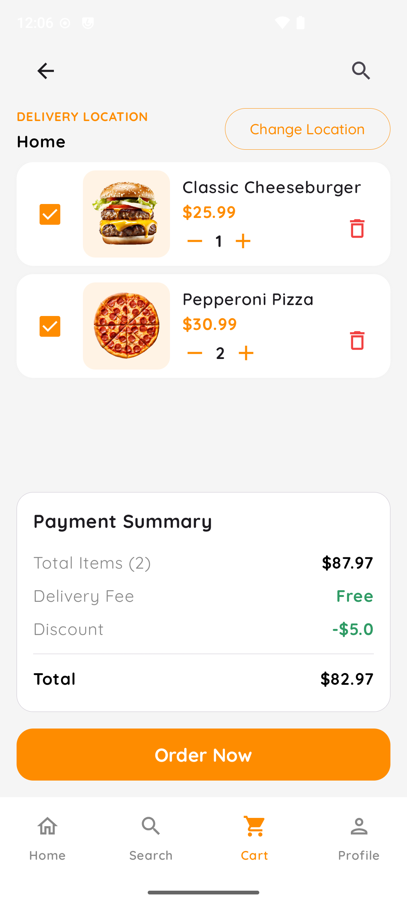
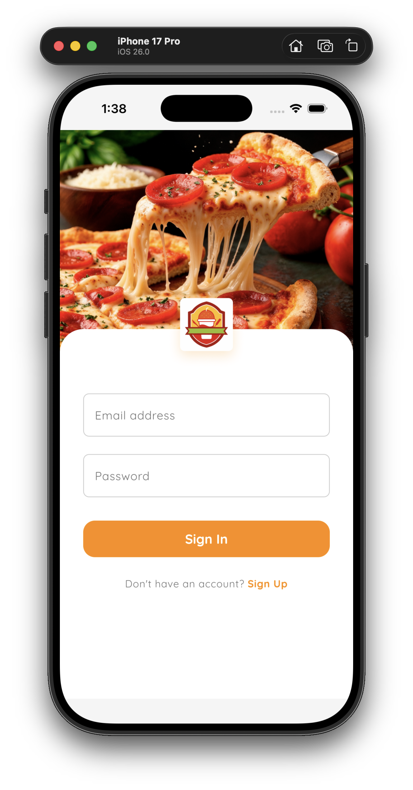
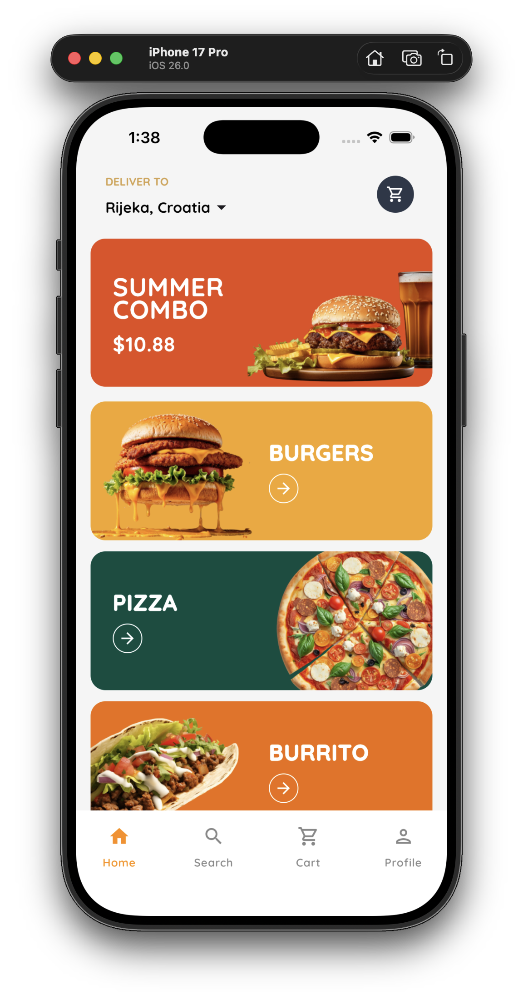
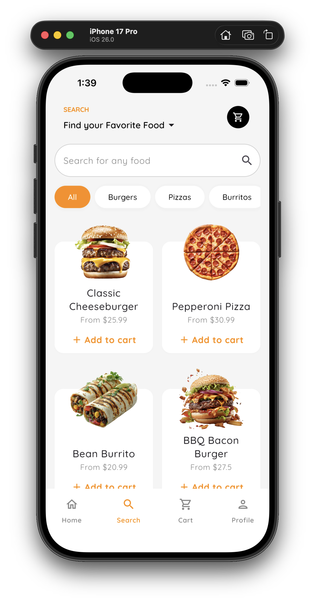
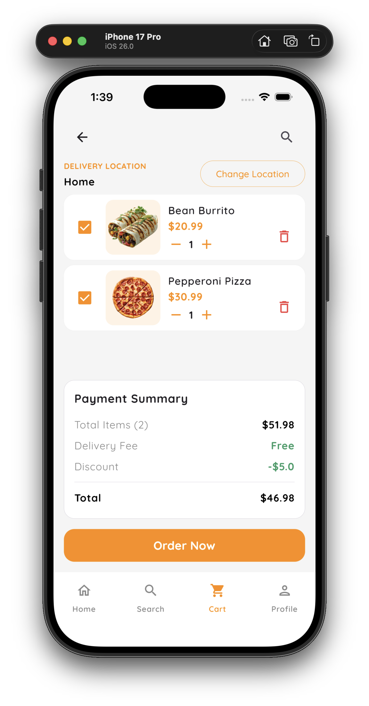
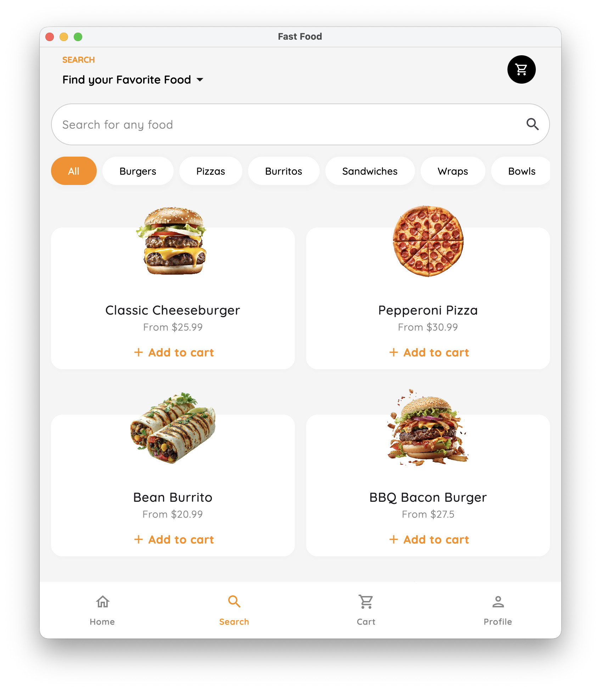
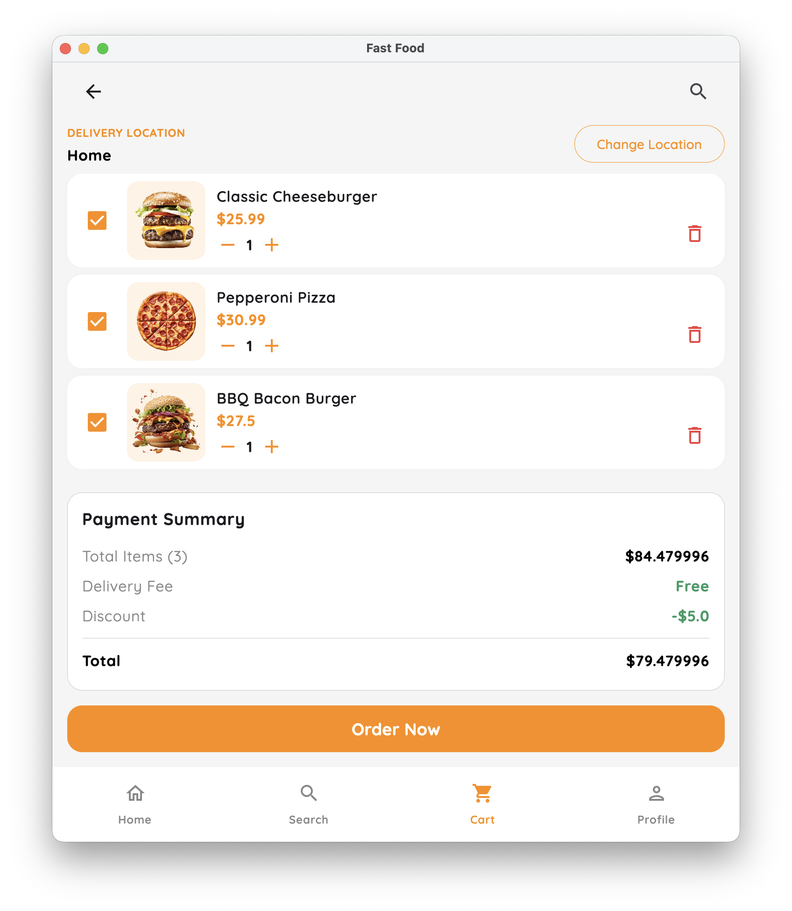

# Fast Food (Kotlin Multiplatform)

A sample Fast Food ordering app built with Kotlin Multiplatform and Compose Multiplatform that runs on Android, iOS, and Desktop (JVM). It demonstrates a shared UI with JetBrains Compose, dependency injection with Koin, and a backend powered by Appwrite (using the KMP Appwrite SDK).

The app includes authentication (sign up/sign in), menu browsing with search and category filters, a cart flow, and basic profile actions.

## Features
- Cross‑platform UI with Compose Multiplatform (Android, iOS, Desktop)
- Email/password authentication via Appwrite
- Menu listing with search query and category filters
- Add to Cart and Cart summary screen
- Simple Profile screen (sign out)
- DI with Koin, state management with ViewModels

## Tech Stack
- Kotlin Multiplatform + Compose Multiplatform (Material 3)
- Koin for Dependency Injection
- Appwrite KMP SDK for auth and data (TablesDB)
- Coil 3 (with Ktor3) for image loading
- JetBrains Compose Navigation

## Architecture at a glance
- Shared UI and logic live in `composeApp/src/commonMain`.
  - `auth` — authentication screens, state, and repository (Appwrite)
  - `food` — menu search, categories, cart
  - `navigation` — Compose Navigation graphs
  - `core` — theme, Appwrite client/config
  - `di` — Koin modules and app DI entry points
- Platform-specific entry points:
  - Android: `composeApp/src/androidMain/...`
  - iOS: `composeApp/src/iosMain/...` (+ `iosApp` Xcode project)
  - Desktop (JVM): `composeApp/src/jvmMain/...`

## Configuration
This project reads required Appwrite configuration from a `secret.properties` file at the repository root (wired via BuildConfig in `composeApp/build.gradle.kts`).

Create or edit `secret.properties` with your own values:

```properties
APPWRITE_PROJECT_ID=your_project_id
APPWRITE_PROJECT_NAME=your_project_name
APPWRITE_ENDPOINT=https://your-appwrite-endpoint/v1
APPWRITE_DATABASE_ID=your_database_id
APPWRITE_BUCKET_ID=your_bucket_id
APPWRITE_USER_COLLECTION_ID=user
APPWRITE_CATEGORIES_COLLECTION_ID=categories
APPWRITE_MENU_COLLECTION_ID=menu
APPWRITE_CUSTOMIZATIONS_COLLECTION_ID=customizations
APPWRITE_MENU_CUSTOMIZATIONS_COLLECTION_ID=menu_customizations
```

Notes:
- Do not commit real secrets in public repos. Consider adding `secret.properties` to `.gitignore` for production projects.
- The Appwrite client and constants are set in `composeApp/src/commonMain/kotlin/com/hraj9258/fastfood/core/data/AppWrite.kt`.
- Add the project id in Android Manifest file and Info.plist File (ios)

### iOS setup
- Open `iosApp/Configuration/Config.xcconfig` and set your Apple `TEAM_ID` (and adjust bundle identifier if needed):
  - `PRODUCT_BUNDLE_IDENTIFIER` is derived from `com.hraj9258.fastfood$(TEAM_ID)`; change to your own if publishing.
- Open the `iosApp` folder in Xcode to run on a simulator or device.

## Build and Run
You can use the IDE run configurations, or the terminal.

### Android
- From Android Studio/IntelliJ, run the Android configuration.
- Or via terminal:
  - macOS/Linux
    ```shell
    ./gradlew :composeApp:assembleDebug
    ```
  - Windows
    ```shell
    .\gradlew.bat :composeApp:assembleDebug
    ```

### Desktop (JVM)
- From the IDE, run the Desktop configuration.
- Or via terminal:
  - macOS/Linux
    ```shell
    ./gradlew :composeApp:run
    ```
  - Windows
    ```shell
    .\gradlew.bat :composeApp:run
    ```

### iOS
- Use the IDE iOS run configuration, or open the [`iosApp`](./iosApp) directory in Xcode and run from there (after setting `TEAM_ID`).

## Project structure
- [`/composeApp`](./composeApp/src) — shared KMP code and platform-specific source sets.
  - [`commonMain`](./composeApp/src/commonMain/kotlin) — code shared by all targets.
  - [`androidMain`](./composeApp/src/androidMain/kotlin) — Android entry points.
  - [`iosMain`](./composeApp/src/iosMain/kotlin) — iOS entry points.
  - [`jvmMain`](./composeApp/src/jvmMain/kotlin) — Desktop entry point.
- [`/iosApp`](./iosApp/iosApp) — iOS app project for Xcode.

## Screenshots

### Android
[](docs/screenshots/Screenshot_android_1.png)
[](docs/screenshots/Screenshot_android_2.png)
[](docs/screenshots/Screenshot_android_3.png)

### IOS
[](docs/screenshots/Screenshot_ios_1.png)
[](docs/screenshots/Screenshot_ios_2.png)
[](docs/screenshots/Screenshot_ios_3.png)
[](docs/screenshots/Screenshot_ios_4.png)


### Desktop
[](docs/screenshots/Screenshot_jvm_1.png)
[](docs/screenshots/Screenshot_jvm_2.png)

## Troubleshooting
- BuildConfig/constant not found: ensure `secret.properties` exists at the repo root with all required keys.
- iOS signing failures: set `TEAM_ID` in `iosApp/Configuration/Config.xcconfig` and check bundle identifier.

## Acknowledgments
- Kotlin Multiplatform and Compose Multiplatform by JetBrains
- Appwrite backend and KMP SDK
- Koin DI, Coil